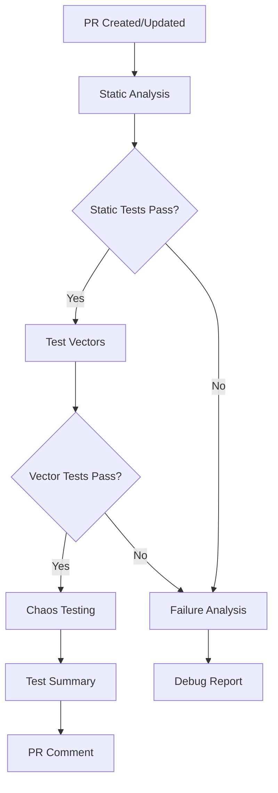

# SlackPolish CI Testing System

## 🚀 **Overview**

The SlackPolish CI Testing System provides **comprehensive automated testing** on every Pull Request using GitHub Actions. It implements a **three-layer testing strategy** that ensures code quality, security, and stability.

## 🏗️ **Three-Layer Testing Architecture**

### **Layer 1: 🔍 Static Analysis Tests**
- **Purpose**: Validates code structure and patterns exist
- **Tests**: 17 test files covering core functionality
- **Coverage**: Function existence, configuration structure, DOM patterns
- **Speed**: ~30 seconds

### **Layer 2: 🎯 Test Vector Analysis**  
- **Purpose**: Validates actual function behavior with known inputs/outputs
- **Tests**: 45 test vectors across 10 functions
- **Coverage**: Input/output validation, edge cases, error handling
- **Speed**: ~15 seconds

### **Layer 3: 🌪️ Chaos Testing**
- **Purpose**: Verifies system stability under extreme conditions
- **Tests**: 4,350+ iterations with random/malicious inputs
- **Coverage**: Security vulnerabilities, crash resistance, edge cases
- **Speed**: ~45 seconds

## 📋 **GitHub Actions Workflow**

### **Workflow File**: `.github/workflows/ci-testing.yml`

### **Trigger Events**
```yaml
on:
  push:
    branches: [ main, develop ]
  pull_request:
    branches: [ main, develop ]
  workflow_dispatch:  # Manual trigger with options
```

### **Job Structure**

#### **Job 1: Static Analysis** 
```yaml
name: 🔍 Static Analysis Tests
runs-on: ubuntu-latest
```
- Sets up Node.js environment
- Runs static code analysis tests
- Validates code structure and patterns
- Uploads test results as artifacts

#### **Job 2: Test Vectors**
```yaml
name: 🎯 Test Vector Analysis  
needs: static-analysis
```
- Runs input/output behavior tests
- Validates function correctness
- Generates test vector reports
- Depends on static analysis success

#### **Job 3: Chaos Testing**
```yaml
name: 🌪️ Chaos Testing
needs: test-vectors
strategy:
  matrix:
    chaos-suite: [text_processing, config_processing]
```
- Runs parallel chaos tests for different function groups
- Uses deterministic seeds for reproducible results
- Tests security and stability under extreme conditions
- Matrix strategy for faster execution

#### **Job 4: Test Summary**
```yaml
name: 📊 Test Summary & Report
needs: [static-analysis, test-vectors, chaos-testing]
if: always()
```
- Aggregates results from all test layers
- Generates comprehensive test report
- Comments on PR with test results
- Always runs regardless of test failures

#### **Job 5: Failure Analysis**
```yaml
name: 🔍 Failure Analysis
if: failure()
```
- Only runs when tests fail
- Provides debugging information
- Suggests remediation steps

## 🎛️ **Workflow Configuration Options**

### **Manual Trigger Options**
```yaml
workflow_dispatch:
  inputs:
    chaos_seed:
      description: 'Chaos test seed for reproducible results'
      default: ''
    test_level:
      description: 'Test level to run'
      type: choice
      options: [all, static, vectors, chaos]
```

### **Environment Variables**
- `CHAOS_SEED`: Deterministic seed for chaos tests
- `NODE_VERSION`: Node.js version (default: 18)

## 📊 **Test Execution Flow**



## 🎯 **Test Results & Reporting**

### **PR Comments**
Every PR receives an automated comment with:
- ✅ **Test Summary Table** - Status of all test layers
- 🛡️ **Security Validation** - Confirmed security protections
- 🎯 **Quality Metrics** - Coverage and stability scores
- 🚀 **CI/CD Readiness** - Production readiness assessment

### **Artifacts Generated**
- `static-test-results` - Static analysis outputs
- `test-vector-results` - Vector test summaries  
- `chaos-*-results` - Chaos test reports per suite
- `comprehensive-test-report` - Complete test analysis
- `failure-analysis` - Debug information (on failure)

### **Sample PR Comment**
```markdown
## 🧪 Automated Test Results

| Test Layer | Status | Count | Coverage |
|------------|--------|-------|----------|
| 🔍 Static Analysis | ✅ Passed | 17 tests | Code structure & patterns |
| 🎯 Test Vectors | ✅ Passed | 45 vectors | Input/output behavior |
| 🌪️ Chaos Testing | ✅ Passed | 4,350+ iterations | Stability & security |

🛡️ **Security Validation**: All injection attacks blocked
🎯 **Quality Score**: 100% stability under extreme conditions
🚀 **Verdict**: Production-ready! ✅
```

## 🔧 **Local Testing Commands**

### **Run All Tests**
```bash
# Complete test suite (matches CI)
node tests/run-all-tests.js

# Static analysis only (CI Job 1)
node tests/run-all-tests.js --exclude-chaos --exclude-vectors

# Test vectors only
node tests/vector/test_text_processing_vectors.js
node tests/vector/test_config_processing_vectors.js

# Chaos tests only
node tests/run-chaos-tests.js

# Specific chaos test with seed
CHAOS_SEED=12345 node tests/chaos/test_text_processing_chaos.js
```

### **Debug Failed Tests**
```bash
# Run with verbose output
node tests/run-all-tests.js --test test_name

# Check specific test file
node tests/unit/test_specific_function.js

# Reproduce chaos test failure
CHAOS_SEED=failed_seed node tests/run-chaos-tests.js
```

## ⚡ **Performance & Efficiency**

### **Execution Times**
- **Static Analysis**: ~30 seconds
- **Test Vectors**: ~15 seconds  
- **Chaos Testing**: ~45 seconds (parallel)
- **Total CI Time**: ~2 minutes

### **Resource Usage**
- **CPU**: Standard GitHub Actions runner
- **Memory**: <512MB peak usage
- **Storage**: <100MB artifacts
- **Network**: No external dependencies

### **Optimization Features**
- **Parallel execution** for chaos tests
- **Conditional job execution** (failure analysis only on failure)
- **Artifact caching** for faster subsequent runs
- **Filtered test execution** for different CI stages

## 🛡️ **Security & Quality Assurance**

### **Security Tests Included**
- ✅ **SQL Injection** resistance
- ✅ **XSS Attack** prevention  
- ✅ **Command Injection** blocking
- ✅ **Path Traversal** protection
- ✅ **Prototype Pollution** prevention
- ✅ **Buffer Overflow** handling
- ✅ **Unicode Exploit** resistance

### **Quality Gates**
- **0% crash tolerance** - No function may crash
- **100% static test coverage** - All code patterns validated
- **95%+ chaos stability** - Robust under extreme conditions
- **Reproducible results** - Deterministic test outcomes

## 🎉 **Benefits**

### **For Developers**
- ✅ **Immediate feedback** on code changes
- ✅ **Comprehensive coverage** without manual testing
- ✅ **Security validation** built-in
- ✅ **Clear failure diagnostics** for quick fixes

### **For Project**
- ✅ **Production confidence** - Thoroughly tested code
- ✅ **Security assurance** - Attack-resistant functions
- ✅ **Stability guarantee** - No crashes under any conditions
- ✅ **Quality consistency** - Automated quality gates

### **For CI/CD**
- ✅ **Fast execution** - Complete in under 2 minutes
- ✅ **No dependencies** - Self-contained testing
- ✅ **Reliable results** - Deterministic and reproducible
- ✅ **Rich reporting** - Detailed test analysis

The SlackPolish CI Testing System ensures **every PR is thoroughly validated** before merge, maintaining the highest standards of code quality, security, and stability! 🛡️🚀
